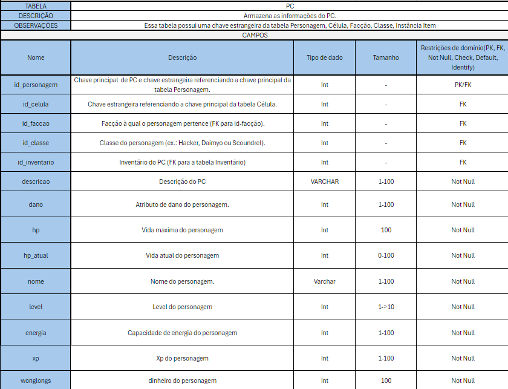
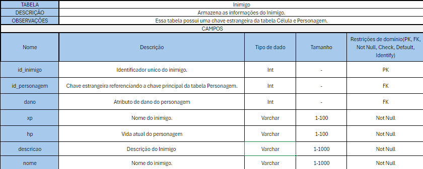
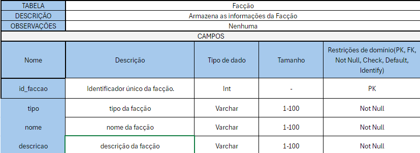

# 
Entrega do Trabalho 1 - Modelagem

## **Dicionário de Dados**

Dicionário de Dados é um registro detalhado que documenta os elementos de um banco de dados, como tabelas, colunas, tipos de dados e restrições. Ele é indispensável para garantir consistência, padronização e clareza, sendo utilizado como referência durante o desenvolvimento, manutenção e evolução do sistema.

