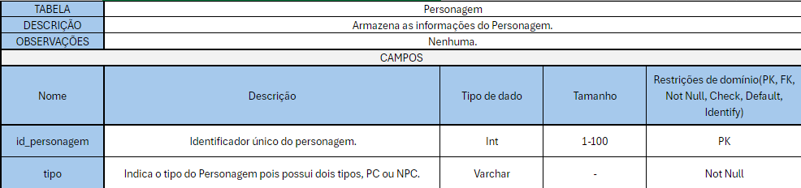
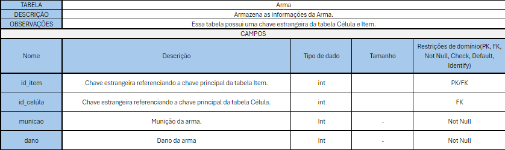
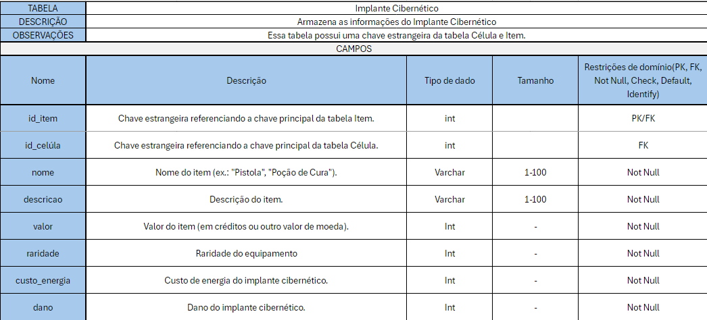

# 
Entrega do Trabalho 1 - Modelagem

## **Dicionário de Dados**

Dicionário de Dados é um registro detalhado que documenta os elementos de um banco de dados, como tabelas, colunas, tipos de dados e restrições. Ele é indispensável para garantir consistência, padronização e clareza, sendo utilizado como referência durante o desenvolvimento, manutenção e evolução do sistema.

## Histórico de Versão
| Versão | Data | Descrição | Autor(es) |
| :-: | :-: | :-: | :-: | 
| `1.0`  | 20/11/2024 | Adição Dicionário de Dados| [Arthur Fonseca](https://github.com/arthrfonsecaa), [Daniel Nunes](https://github.com/DanNunes777), [Lucas Caldas](https://github.com/lucascaldasb), [Mateus Santos](https://github.com/14luke08), [Rudson Martins](https://github.com/RudsonMartin) |
| `2.0` | 08/11/2024 | Update Dicionário de Dados | [Arthur Fonseca](https://github.com/arthrfonsecaa) |
| `2.1` | 08/11/2024 | Update Dicionário de Dados | [Arthur Fonseca](https://github.com/arthrfonsecaa) |
| `2.2` | 08/11/2024 | Update Dicionário de Dados | [Arthur Fonseca](https://github.com/arthrfonsecaa) |
| `2.3 Final` | 10/02/2025 | Update Dicionário de Dados | [Arthur Fonseca](https://github.com/arthrfonsecaa) |

