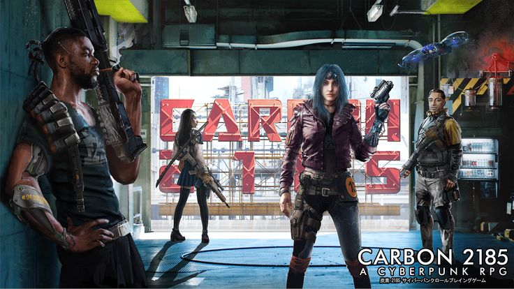

# 

Carbon 2185, um RPG de Cyberpunk.

## Sobre o jogo:  

• Carbon 2185 é um RPG de cyberpunk ambientado em um futuro distópico, no ano de 2185. Inspirado pelo universo de jogos como Cyberpunk 2020 e pela estética de obras como Blade Runner, Ghost in the Shell e Neuromancer, o jogo combina elementos clássicos do gênero cyberpunk com uma mecânica baseada no sistema d20, semelhante ao de Dungeons & Dragons 5ª Edição. Em Carbon 2185, os jogadores assumem o papel de mercenários, hackers, ciborgues e outros personagens que lutam para sobreviver em uma sociedade dominada por mega-corporações, tecnologia invasiva e uma alta criminalidade.

• O sistema de jogo coloca grande foco em combate tático, hackeamento e personalização dos personagens, permitindo que cada jogador modifique seu corpo com aprimoramentos cibernéticos e escolha habilidades que se alinhem ao estilo único do seu personagem.

## Objetivo:

• Desenvolver um jogo no estilo Carbon 2185 com mecânicas básicas e ambientação textual, rodando exclusivamente no CMD.

## Contribuidores:

<table>
  <tr>
    <td align="center">
      <a href="https://github.com/arthufonsecaaa">
        
         <b>Arthur Fonseca - 221031120</b>
      </a>
    </td>
    <td align="center">
      <a href="https://github.com/RudsonMartin">
        
         <b>Rudson Martins - 222006418</b>
      </a>
    </td>
    <td align="center">
      <a href="https://github.com/14luke08">
        
         <b>Mateus Santos - 200024825
      </a>
    </td> 
    <td align="center">
      <a href="https://github.com/lucascaldasb">
        
         <b>Lucas Caldas - 190091606</b>
      </a>
    </td>
    <td align="center">
      <a href="https://github.com/DanNunes777">
        
         <b>Daniel Nunes - 211062910</b>
      </a>
    </td>
  </tr>
</table>

